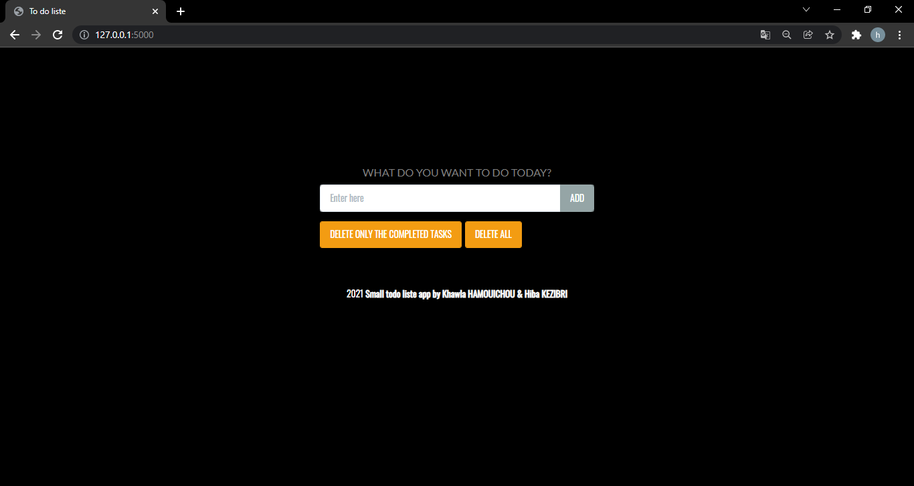
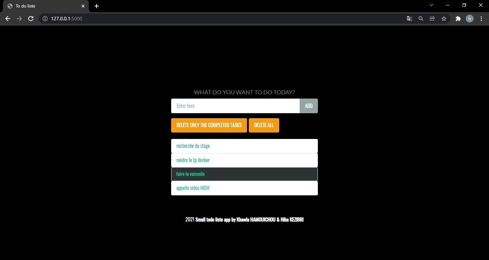

# To-Do-list
## Sujet
Réalisation d'une petite application web to-do list avec le micro framework flask et MongoDB sur visual studio.  

##Objectifs
```
- Etablir la connexion entre mongodb et python 
- Ajouter les taches  Afficher les taches
- Distinguer entre les taches compléter et les non compléter
- Supprimer les taches compléter seulement 
- Supprimer toutes les taches (compléter/non compléter) 
```

## aperçu sur l'application web



